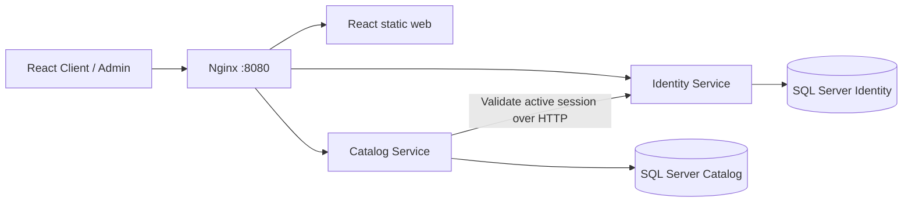

# SEM3 Group 01 — Microservices Starter

Code base mẫu cho dự án cuối khóa, chưa gắn với đề tài chính thức. **ASP.NET Core 10**, **React + TypeScript + Vite**, **SQL Server 2022**, Docker Compose và Nginx gateway.

## Chạy nhanh (Windows / OneDrive)

Cần Docker Desktop ở chế độ Linux containers. Hai SQL Server cần khoảng 4 GB RAM tối thiểu; nên cấp Docker 6–8 GB cho toàn stack.

```powershell
# Từ thư mục gốc repository
powershell -NoProfile -File scripts/start-dev.ps1
```

Script tạo `.env` với secret ngẫu nhiên, copy build context vào `%TEMP%\sem3-group1-docker` để tránh lỗi Docker đọc OneDrive reparse points, build image, chạy migration rồi khởi động. Chạy lại script sau khi đổi code. Không xóa volume dữ liệu.

- Khách hàng: http://localhost:8080
- Quản trị: http://localhost:8080/admin
- Email admin: `ADMIN_EMAIL` trong `.env` (mặc định `admin@sem3.local`).
- Mật khẩu admin: `ADMIN_PASSWORD` trong `.env`. Không có mật khẩu cố định trong source.
- Đăng ký trên web luôn tạo tài khoản `Customer`; Admin có thể đổi role.
- Đổi `WEB_PORT` trong `.env` nếu cổng 8080 đã được dùng.

Ngoài OneDrive, có thể dùng trực tiếp:

```powershell
powershell -NoProfile -File scripts/init-dev.ps1
docker compose build
docker compose up -d --no-build
```

Quản lý từ thư mục gốc: `docker compose ps -a`, `docker compose logs --tail 100 identity catalog`, `docker compose stop`. Không dùng `down -v` nếu cần giữ dữ liệu. `.env` và bản sao trong thư mục tạm chứa secret local: không commit/chia sẻ. Đổi ADMIN_PASSWORD trong `.env` không đổi mật khẩu tài khoản đã tồn tại; seed chỉ tạo lần đầu.

## Kiến trúc



Mỗi service nghiệp vụ có project, process, image, migration và database riêng. Không truy cập chéo database. Shared chỉ chứa plumbing JWT/HTTP/phân trang, không chứa entity nghiệp vụ. Gateway chỉ định tuyến.

```text
backend/
  Shared/                    JWT, errors, paging contracts
  IdentityService/
    Models/                  User, RefreshSession
    DTOs/                    Request/response + validation
    Repositories/            EF Core data access
    Services/                Authentication, token, user management
    Controllers/             REST API + authorization
    Data/Migrations/         DbContext + versioned migrations
  CatalogService/
    Models/ DTOs/ Repositories/ Services/ Controllers/ Data/Migrations/
frontend/src/
  auth/                      Session provider
  lib/                       API client + refresh retry
  components/                Header/Footer/Sidebar, pagination
  pages/                     Client/Admin, login/register, account, users, catalog
infra/                       Nginx gateway + SPA server
scripts/                     Setup/startup/integration tests
```

Backend MVC Web API: **Controller → Service → Repository → DbContext/Model**; DTO tách khỏi entity; React là View. Catalog là nghiệp vụ mẫu để thay thế khi nhận đề tài.

## Chức năng

- Đăng ký, đăng nhập, đăng xuất, tài khoản hiện tại; role Admin/Customer, kiểm tra tại backend và route guard frontend.
- JWT access token 5 phút trong memory, không localStorage. Refresh token 7 ngày trong cookie HttpOnly + SameSite Strict; DB chỉ lưu SHA-256.
- Refresh rotation một lần, SQL rowversion chặn dùng đồng thời một token. Reload web khôi phục qua refresh cookie.
- ASP.NET Core PasswordHasher, validation mật khẩu; sai 5 lần khóa đăng nhập 15 phút.
- Đổi quyền/khóa thu hồi phiên. Đăng xuất hiện áp dụng cho **mọi phiên của tài khoản**.
- Catalog kiểm tra JWT rồi hỏi Identity về trạng thái/version: token bị thu hồi không tiếp tục ghi dữ liệu. Identity không khả dụng thì request cần xác thực bị từ chối.
- API ghi dữ liệu yêu cầu `X-Requested-With: SEM3`. Không mở CORS; web gọi cùng origin qua gateway/Vite proxy.
- Admin tìm kiếm/phân trang người dùng, đổi quyền, khóa/mở khóa; không tự hạ quyền/khóa chính mình.
- Catalog CRUD, nháp/công khai, tìm kiếm/phân trang server-side; khách chỉ thấy sản phẩm công khai.
- Khung client/admin responsive, loading/error/empty, 403/404.
- Migrations, seed admin + 24 sản phẩm mẫu (22 công khai), health endpoint kiểm tra SQL.

## API

| Method | Endpoint | Quyền |
|---|---|---|
| POST | `/api/auth/register` | Công khai, luôn Customer |
| POST | `/api/auth/login` | Công khai |
| POST | `/api/auth/refresh` | Refresh cookie |
| POST | `/api/auth/logout` | Refresh cookie |
| GET | `/api/auth/me` | Đăng nhập |
| GET | `/api/users?page=1&pageSize=10&search=` | Admin |
| PATCH | `/api/users/{id}` | Admin, body `{role,isActive}` |
| GET | `/api/products?page=1&pageSize=9&search=` | Công khai; Admin thấy nháp |
| GET | `/api/products/{id}` | Công khai; nháp chỉ Admin |
| POST/PUT/DELETE | `/api/products[/{id}]` | Admin |
| GET | `/health/identity`, `/health/catalog` | Health local |

Danh sách trả `{items,totalCount,page,pageSize,totalPages}`. Page >= 1, pageSize 1–100. Lỗi trả ProblemDetails; validation có `errors`. API cần đăng nhập dùng `Authorization: Bearer <accessToken>`.

## Build / kiểm thử

```powershell
dotnet build SEM3.slnx -m:1
cd frontend
npm ci
npm run build
cd ..
# Sau khi stack Docker chạy; cần Python 3
python scripts/smoke-test.py
```

Smoke test gọi HTTP thật qua gateway/SQL Server: đăng ký, email trùng, mật khẩu yếu, role injection, JWT sửa/hết hạn/sai audience, refresh rotation/race, CSRF, 401/403, CRUD, draft visibility, phân trang, thu hồi token xuyên service, logout và lockout. Test xóa sản phẩm tự tạo; giữ tài khoản test ở trạng thái khóa để audit. Không chạy trên production. Auth rate limit hiện 60 request/phút cho toàn instance; đợi một phút giữa các lần test.

## Phát triển tiếp

- Frontend hot reload: `cd frontend; npm run dev`. Vite proxy mặc định Identity tại 5101, Catalog tại 5102. Nếu dùng Docker backend, đổi target proxy trong `vite.config.ts` sang `http://localhost:8080`.
- Backend local: cấu hình `ConnectionStrings__Database`, `Jwt__Key`, `ASPNETCORE_URLS`, `Identity__BaseUrl` qua environment hoặc user-secrets. SQL Compose không publish port; nếu dùng SSMS/local backend thêm override port localhost riêng.
- Thêm migration: `dotnet ef migrations add <Name> --project backend/<Service>`; cần cấu hình Jwt__Key khi host khởi tạo. Migration chạy bằng container `*-migrate` trước API, không dùng EnsureCreated.
- Thêm service: database/DTO riêng, các lớp theo mẫu, thêm route gateway và Compose.

## Phạm vi

Đây là môi trường local: Development, HTTP localhost; cookie Secure bật ngoài Development. Khi deploy thật cần HTTPS, secret manager, tài khoản SQL tối thiểu quyền thay `sa`, rate limit phân tán, audit/backup và quản lý khóa ký (asymmetric/OIDC khi mở rộng). HMAC key chỉ cấp cho hai backend tin cậy, không đưa ra frontend. Refresh session hết hạn hiện được giữ trong DB, cần retention job khi vận hành lâu dài.

Email xác minh/quên mật khẩu và app mobile có trong checklist ảnh nhưng **chưa triển khai trong đợt nền tảng web/auth này**. Chưa có đơn hàng, thanh toán hay nghiệp vụ đề tài.

Tham khảo: [Microsoft — JWT bearer configuration](https://learn.microsoft.com/en-us/aspnet/core/security/authentication/configure-jwt-bearer-authentication?view=aspnetcore-10.0).
